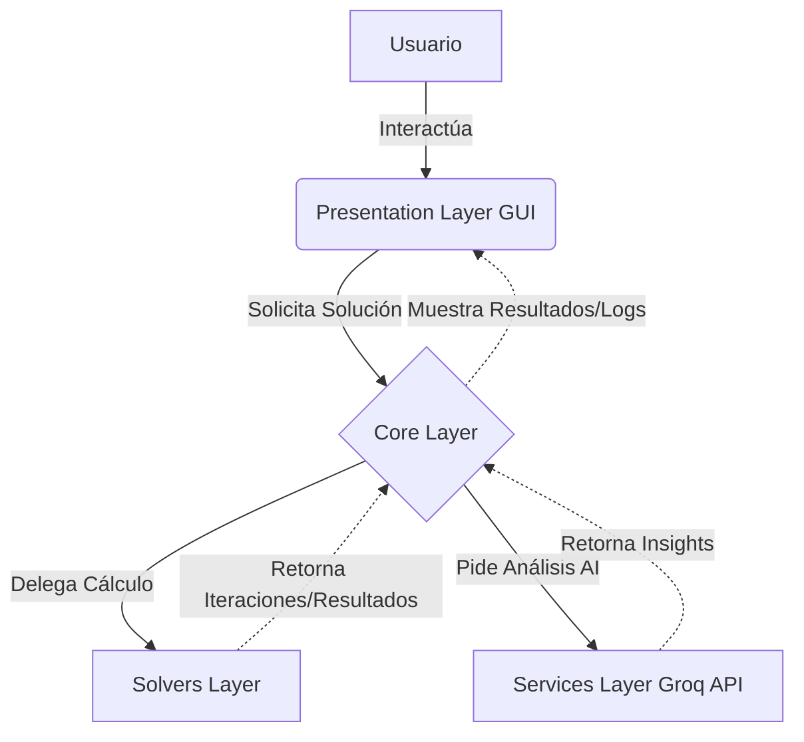

# 🧮 OpticSolver

Una calculadora avanzada y moderna para resolver problemas de Investigación de Operaciones (Programación Matemática), específicamente enfocada en problemas de transporte y optimización logística. Implementada con Python y una arquitectura modular, separando limpiamente la lógica de negocio, servicios externos (AI) y presentación gráfica.

---

## 🚀 Características Principales

- **Algoritmos de Optimización:** Implementación de varios métodos para resolver problemas de transporte (ej. Método de Costo Mínimo, Aproximación de Vogel).
- **Análisis con Inteligencia Artificial:** Integración con Groq API para proporcionar análisis de nivel ejecutivo y recomendaciones sobre las soluciones obtenidas.
- **Interfaz de Usuario Moderna:** GUI estéticamente agradable con tema oscuro ("Dark Mode"), "Soft UI" / Glassmorphism, construida con `customtkinter` y separada estrictamente de la lógica de negocio.
- **Exportación y Trazabilidad:** Generación de logs detallados e iteraciones paso a paso en archivos de texto.
- **Arquitectura Limpia:** Código altamente modular ("Clean Architecture"), DRY, fácil de mantener y escalar.

---

## 🏗️ Arquitectura del Sistema

El proyecto sigue los principios de **Clean Architecture**, dividiendo las responsabilidades en capas claras para mantener el código mantenible y testeable.



---

## 📂 Estructura del Proyecto

```text
OpticSolver/
├── src/
│   ├── core/           # Entidades de dominio y lógica de orquestación principal
│   ├── presentation/   # Componentes de la interfaz gráfica (GUI, estilos, temas)
│   ├── services/       # Integraciones con servicios externos (ej. Groq API para AI)
│   ├── solvers/        # Implementación de los algoritmos matemáticos (Costo Mínimo, Vogel)
│   └── main.py         # Punto de entrada de la aplicación
├── .env                # Variables de entorno (API Keys, configuraciones)
├── requirements.txt    # Dependencias de Python
└── README.md           # Documentación del proyecto
```

---

## 🛠️ Tecnologías y Stack

- **Lenguaje:** Python 3.x
- **Interfaz Gráfica:** `customtkinter`, `tkinter`
- **Inteligencia Artificial:** `groq` (Groq API)
- **Patrones de Diseño:** Factory, Clean Architecture, Inyección de Dependencias.

---

## ⚙️ Instalación y Uso

1. **Clonar el repositorio:**
   ```bash
   git clone https://github.com/antorlok/OpticSolver.git
   cd OpticSolver
   ```

2. **Crear y activar entorno virtual (Opcional pero recomendado):**
   ```bash
   python -m venv venv
   source venv/bin/activate  # En Linux/Mac
   # venv\Scripts\activate   # En Windows
   ```

3. **Instalar dependencias:**
   ```bash
   pip install -r requirements.txt
   ```

4. **Configurar el entorno:**
   Crea un archivo `.env` en la raíz del proyecto basándote en la configuración necesaria (ej. `GROQ_API_KEY=tu_api_key_aqui`).

5. **Ejecutar la aplicación:**
   ```bash
   python src/main.py
   ```

---

## 👨‍💻 Autor

- **Antorlok** - [GitHub Profile](https://github.com/antorlok)
